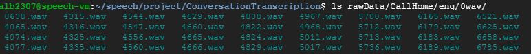
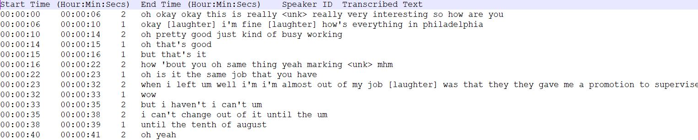

# Transcribe Conversational Speech

### ALB2307 - Austin Bell
December 18, 2019

Report Name: Speech Recogntion and Speaker Diarization Transcription Tool

Abstract: In this project, I operationalize a transcription tool that leverages models designed within the Kaldi toolkit. The tool consists of two models for transcribing conversational speech: a speech recognition model and speaker diarization model. Our approach, first leverages an algorithm similar the CallHome Diarization example. Second I utilize a pretrained speech recognition model for the ASPiRE competition to transcribe speech to text. These two models are combined under a single easy-to-use framework to create transcribed text files for facilitating further data mining. 

List of tools outside of Kaldi: 
 * SRI International Language Model Tools: https://www.sri.com/
 * Sequitur G2P: https://github.com/sequitur-g2p/sequitur-g2p
 
 No Kaldi Recipes were utilized in the development of this tool, therefore no diff files are presented. 

Scripts and directory related to tool that transcribes conversational speech.  Takes as conversational speech files as input and returns formatted transcribed and diarized conversation.  A single text file is returned per speech file.  Subsequent data mining can then be performed on returned text files. 

## Inputs
Tool takes conversational speech files of varying file types as input.  For the purpose of development, I utilized the CallHome English Corpus. Sample of input directory pictured below:

## Outputs
For each file, a conversation transcript is exported.  A sample of the export is pictured below:

## Data
For testing and development purposes, I leveraged the CallHome English dataset.  Information can be found at this link. The dataset is a phone call between two native english speakers.  It consists of 120 calls and each call can last up to 30 minutes. Calls can be between male or females from varying ages. 

Data sourced from Language Data Consortium

## Results
Some varying results from the models utilized in this tool 
 * Diarization Error Rate %: 10.4%1
 * Original ASR Model WER %: 27.7%2
 * ASR WER % on CallHome data: 33.2%

## Tool Structure and Script Details 

All listed files generated from scratch by me.  Partially touched files are commented with my UNI in the code base

~/ : home directory responsible for running all other scripts, storing results, and data

##### Command to run the entire process: bash transcribe_conversation.sh --lm_expansion true rawData/CallHome testdir 2

 * transcribe_conversations.sh: bash script that runs the entire process from start to finish.  
   * Mandatory inputs: directory to raw speech files; name of desired output directory; number of speakers in file ("unknown" is also an option)
   * Optional inputs: threshold for clustering PLDA scores when number of speakers is unknown; whether to expand the language model with additional words; corpus to use for language model expansion 
   * Process:
     * Resets all directories (Kaldi will not re-write files if they exist)
     * Run Diarization
     * Run Speech Recognition (with possible language model expansion)
     * Format results into nice text files 
     
 * formatTranscriptions.py: formats results into user readable text files that are diarized and transcribed
   * Mandatory input: output directory
   * Process: 
     * parse decoded results and split into separate files
     * parse speaker information, time stamps, and text  
 
diarizer/ : folder containing all scripts and tools related to speaker diarization
 * run_diarization.sh: primary script for running the diarization process
   * Mandatory inputs: number of speakers ("unknown" is an option)
   * Optional inputs: threshold for clustering of PLDA scores 
   * Process:
     * Generate the segments file using an energy based speech activity detection algorithm 
     * Once segments file has been created then generate other features (MFCC)
     * Extract X-vectors from trained X-Vector model
     * Score PLDA 
     * Cluster PLDA scores to complete diarization (able to select number of speakers or select an unknown number of speakers)
     * export diarization results for use in ASR system
     
 * local/initData.py: initialize data inputs for use in diarization
   * Mandatory Inputs: input directory; output directory
   * Process: 
     * Create file list of speech files from input directory
     * Generates wav.scp and utt2spk leveraging and all speech files in the input directory 
     * outputs wav.scp and utt2spk in output data directory
     * ensure that speech files are processed correctly (16,000 hz, monophone, 16 bits, wav)
     
 * local/combineSegments.py: Combines short segments
   * Mandatory Inputs: segments directory
   * process:
     * Sometimes the segments that are created from energy-based SAD system are too long for proper X-vector extraction
     * for each segment:
       * identifies whether the segments is too short and combines them with the succeeding segment
     * outputs new segments file
 
asr/ : folder containing all scripts and tools related to automatic speech recognition
 * run_asr.sh: Transcribes speech files to text 
   * Mandatory inputs: diarization results
   * Optional inputs: whether or not to expand language model; new corpus for expanding the language model
   * Process:
     * Copies over results from Diarization
       * Option to use ground truth diarization results for evaluation
     * Generate new segments from RTTM results
     * Expands, prepares, and formats the language model, which is used as input the graph
     * Makes the HCLG Graph
     * Generates features (MFCC)
     * Extracts I-Vectors
     * Utilizes trained ASR model for decoding
       * Option to score results if using ground truth data
       
 * lmExpansion.sh: expands the language model with new 
   * Optional Inputs: corpus for expanding the language 
   * Process: 
     * Converts supplied corpus to a unique word list
     * Utilizes Sequitur G2P to generate phonemes from graphemes
     * Generate ngram language model using SLR toolkit
     * Merge generated files with original language model
     * Copy necessary files into necessary directories
     
 * local/RTTM2Files.py: converts diarization results to necessary files
   * Mandatory Input: Directory with RTTM files
   * Process: 
     * Parses the RTTM file to extract speaker ID and time stamps
     * Generate new Segments file
     * Generate new Utt2spk file
     
 * local/genCallHomeCorpus.py: generate corpus to expand the language model with
   * Mandatory Input: Ground Truth CallHome Transcripts 
   * Process:
     * Combines all transcripts from CallHome Data 
     * Cleans and Parses files (e.g., remove all non-verbal speech)
     * exports
 
 * local/ChWordsSegments.py: create ground truth labels for CallHome data
   * Mandatory inputs: Callhome transcripts
   * Process:
     * Combines Callhome Transcripts
     * for each file: 
       * parse and clean lines
       * formats for inclusion in ground truth segments and text files 
     * exports ground truth files 
     
 * local/rmNonWords.py: remove non-verbal speech and punctuation prior to scoring WER. Necessary since non-verbal speech are treated differently between dataset used for training and CallHome
   * Mandatory Inputs: ground truth text file and best predicted lattice path
   * Process:
     * for the ground truth file
       * removes all nonverbal speech
       * remove punctuation
     * for each best lattice path file
       * removes all nonverbal speech
     * exports

## References
1. G. Sell, D. Snyder, A. McCree, D. Garcia-Romero, J. Villalba, M. Maciejewski, V. Manohar, N. Dehak, D. Povey, S. Watanabe, et al., Diarization is hard: Some experiences and lessons learned for the JHU team in the inaugural DIHARD challenge, in Proc. Interspeech, pp. 2808–2812, 2018. Methodology in the previous paper is applied to CallHome Dataset for results
2. V. Peddinti, G. Chen, D. Povey, S. Khudanpur, Reverberation robust acoustic modeling using i-vectors with time delay neural
networks, in Proc. Interspeech, 2015
